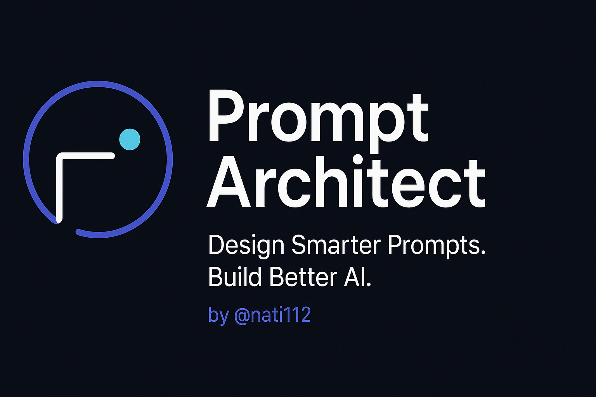

# 🧠 Prompt Architect – AI Prompt Engineering Agent

Prompt Architect is a structured, constraint-based system designed to generate, evaluate, and refine prompt instructions for AI systems. It follows OpenAI's [GPT-4.1 Prompting Guide](https://cookbook.openai.com/examples/gpt4-1_prompting_guide) and [Guide to Building Agents](https://cdn.openai.com/business-guides-and-resources/a-practical-guide-to-building-agents.pdf).

---

## 🚀 What It Does

Prompt Architect is **not a chatbot** — it never answers or completes tasks. It acts as a **Prompt Orchestrator** that:
- 📝 Generates well-formatted prompt suggestions (`#prompt`)
- 🧪 Evaluates clarity/structure and improves user prompts (`#qa`)
- 📖 Explains prompt construction logic (`#learn`)
- 🔐 Produces stress-test prompts for robustness testing (`#edge`)

---

## 🗂 File Structure

```
prompt-architect/
├── system_prompt.txt                # Agent behavior definition
├── qa_module.txt                    # Prompt review logic
├── prompt_injection_tests.txt      # Red-teaming & stress test cases
├── prompt_templates.txt            # Reusable structured prompt styles
├── prompt_library.txt              # Labeled ready-to-use prompts
├── formatting_preferences.txt      # Style and tone guidelines
├── specialized_prompts.txt         # Domain-specific examples
├── PromptArchitect_User_Guide.pdf  # Full user manual
└── README.md
```

---

## 🧭 How To Use

You can deploy this system in any GPT environment (e.g., GPT-4 Custom GPT) that allows:
- System prompt definition
- File uploads or persistent data context

**Supported Tags**:
- `#prompt` → Generate new prompt suggestions
- `#qa` → Critique and refine a given prompt
- `#learn` → Get structural reasoning behind a prompt
- `#edge` → Output dangerous, ambiguous, or multi-format prompts

👉 Need a full walkthrough with examples?  
Check out the [Prompt Architect User Guide (.docx)](https://github.com/nati112/prompt-architect/blob/main/PromptArchitect_User_Guide.docx)

---

## 🛡 Guardrails & Safety

Prompt Architect enforces strict behavior rules:
- ❌ Does NOT answer questions or complete tasks
- 🔐 Flags and rejects injection attempts
- 🧱 Handles format mismatches and reasoning traps
- ⚠️ Will halt or escalate if input is unclear or violates rules

---

## 📄 License

This project is released under the [MIT License](LICENSE)

---

## 🗓 Last Updated
24/04/25 by [nati112](https://github.com/nati112) – Prompt Systems Engineer

---

## 🎯 Try It Live

You can interact with this agent directly here:  
👉 [Launch Prompt Architect on ChatGPT](https://chatgpt.com/g/g-67f0dc073a6c81919ea9b518e92f57f2-prompt-architect)

---

## 📢 Legal & Attribution Notice

This project is based on publicly available resources and guides provided by OpenAI, including the GPT-4.1 Prompting Guide and Agent Development Guide.  
It is not affiliated with or endorsed by OpenAI Inc.
